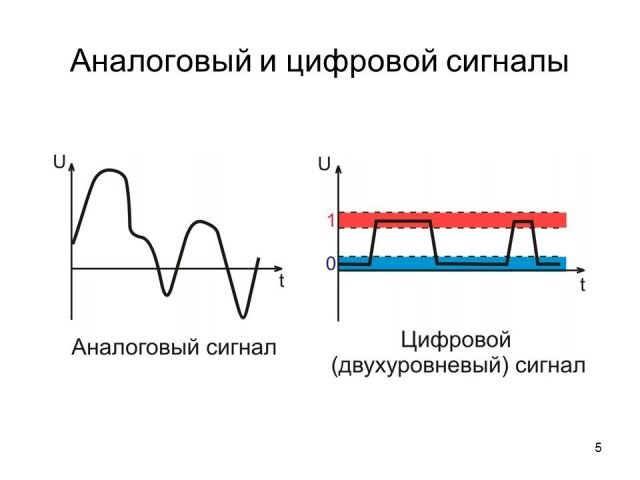

# 1.3. Types of variables

## Для чего формируется выборка?

Нас интересуют некоторые характеристики генеральной совокупности, которые мы решили исследовать при помощи нашей выборки.

Все типы переменных, с которыми мы так или иначе столкнёмся, можно разделить на 2 группы:

+ Количественные:
	- непрерывные
	- дискретные

+ Качественные

Скорее всего вы уже имели дело с таким форматом данных, как большая таблица, где строки - номера испытуемых или элементов выборки, а столбцы - характеристики элементов, которые удалось зафиксировать при формировании выборки.

Давайте поговорим подробнее о переменных.

## Количественные переменные

**Количественные переменные** - представляют обой измеренные значения некоторого признака.

**Непрерывная переменная** может принимать абсолютно любые значения на некотором промежутке. Примером является рост человека на интервале от 160 до 190см (абсолютно любое значение из этого интервала).

**Дискретные переменные** принимают строго определённые значения. Примером является количество детей в семье (только целые числа)

Вообще говоря, **`Дискретной (прерывной)`** называют случайную величину, которая принимает отдельные возможные значения с определенными вероятностями.

Хорошим примером являются аналоговые и цифровые сигналы - у аналоговых сигналов допустимы различные значения в пределах интервала, а у цифровых сигналов значения "статичны".

## Качественные (номинативные) переменные

Такие переменные используются для разделения наших испытуемых или наблюдений на группы.

Например, мы можем сказать, что все участники эксперимента женского пола будут обозначены цифрой 1, а все участники мужского пола - цифрой 2 оответственно.

Таким образом, в случае номинативных переменных за цифрами не стоит никакого математического смысла. В данном случае цифры используются как маркеры различных смысловых групп, в отличие от количественных переменных.

## Ранговые переменные

Ещё один важный тип переменных это так называемые ранговые переменные.

Представьте, что у нас есть информация о марафонском забеге: кто прибежал в каком порядке. Мы можем сказать, что испытуемый с рангом 1 быстрее, выше, сильнее испытуемого с рангом 5. Но вот насколько или во сколько он опережает этого испытуемого мы сказать не можем. Единственной возможной математической операцией является сравнение - кто быстрее, а кто медленнее.

Можно проделать целый путь от количественной переменной к номинативной: 

+ можно измерить рост испытуемых - это будет непрерывная количественная переменнная
+ проранировать рост испытуемых - перевести их в ранговую переменную
+ разделить их на две группы: 1 - выше среднего, 2 - ниже среднего, т.е. делать номинативную переменную

