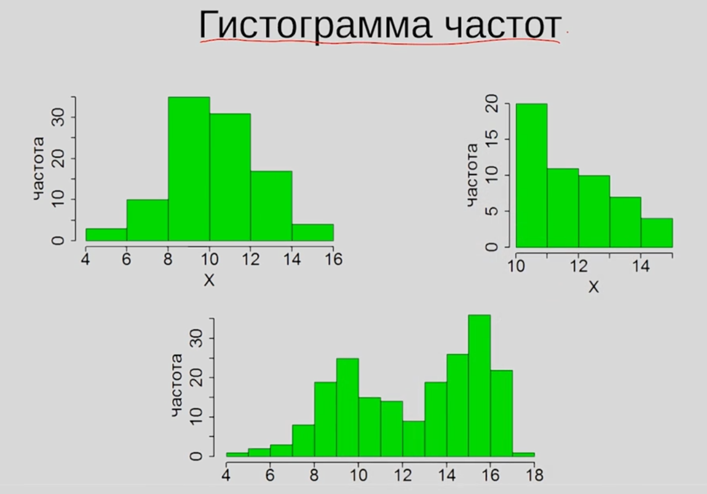
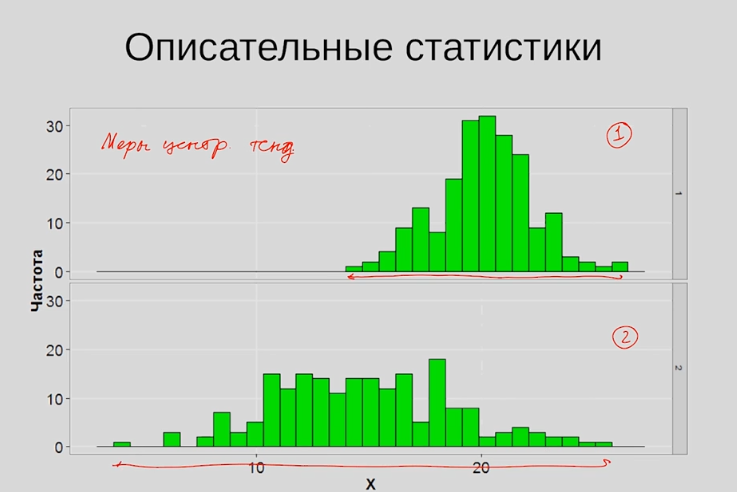
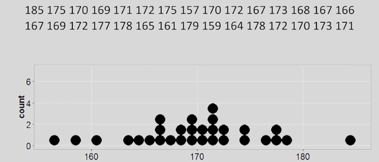
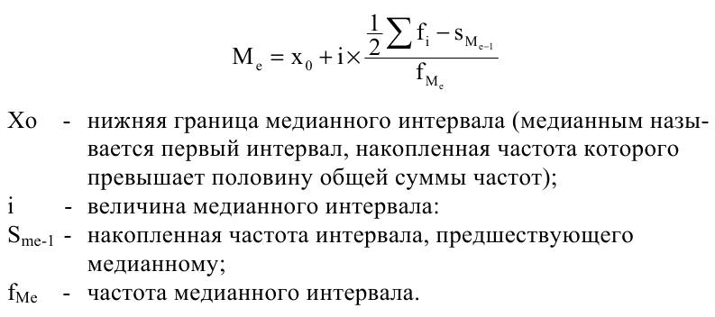
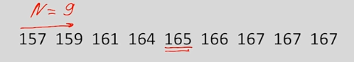
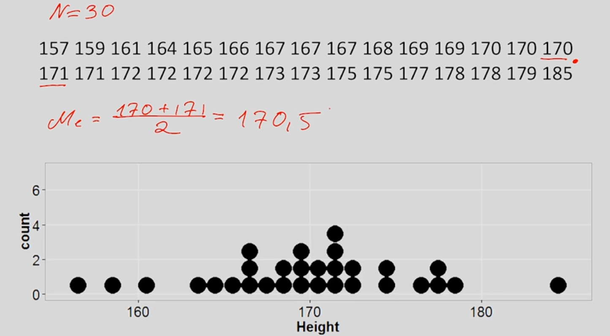
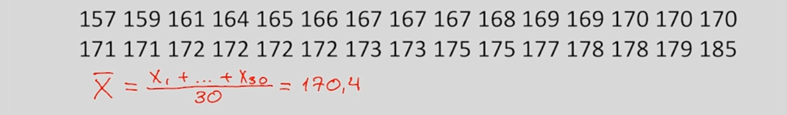
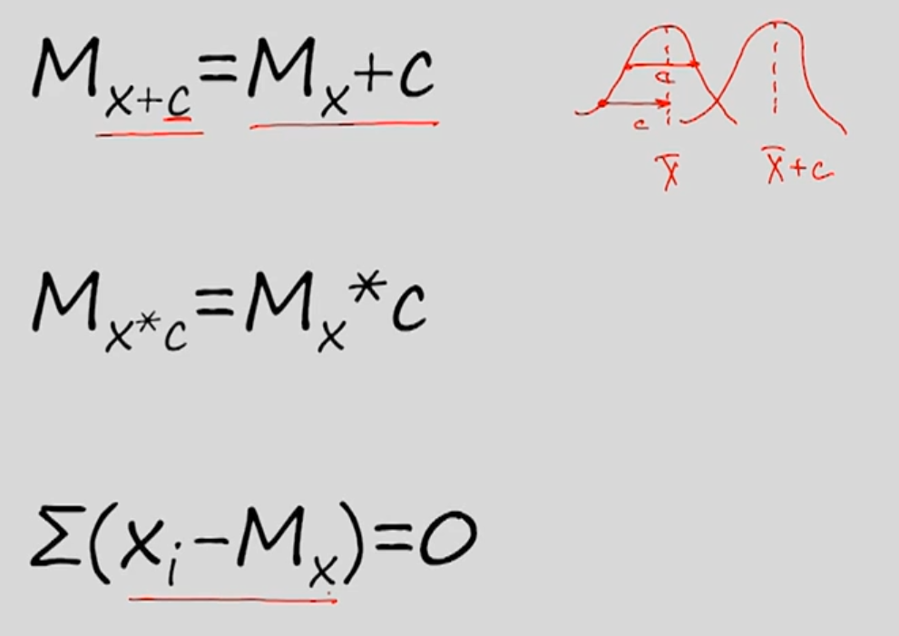

# 1.4 Меры центральной тенденции

## Определение

Познакомимся с определением описательной статистики.

Предположим мы уже сформировали выборку, разобрались с типами переменных и теперь хотим исследовать форму их распределений.

Что вообще значит фраза `распределение некоторой переменной`?

Когда речь идёт о номинативных переменных нет ничего проще посмотреть какое количество переменных оказалось в той или иной группе. Гораздо интереснее изучать распределение количественных признаков.

Для этого используются гистограммы частот. 

**Гистограмма частот** - достаточно распространённый график, позволяющий сделать первое впечатление о форме распределения нашего количественного признака.

Пусть `x` - некоторая переменная, и мы можем посмотреть как часто значение этой переменной встречается на определённом промежутке.

Например, в диапазоне от 8 до 10 значение `x` встречается более 30 раз, а на промежутке от 6 до 10 уже только 10. При этом распределение является симметричным, поскольку большинство наблюдений оказалось как бы в центре нашего распределения. И чем дальше мы отклоняемся вправо/влево тем реже встречаются значения нашего признака.

На втором графике - ярко выраженная ассиметрия. 

А на рисунке 3 представлены два интересных диапазона, где переменная `x` встречается чаще, чем на других промежутках.

В принципе для исследования распределения некоторой переменной мы познакомимся с двумя типами описательных статистик.

**Первый тип - меры центральной тенденции**. Он позволяет нам ответить на вопрос - насколько в принципе высокие значения принимает наша переменная.

На гистограмме 1 большинство наблюдений нашей переменной имеют более высокие значения, чем во втором случае. При этом во втором случае - более широкий диапазон, на котором могут возникать наши наблюдения.

И когда мы будем говорить про изменчивость нашего признака, про его вариантивность используются **меры изменчивости**.

## Меры центральной тенденции

Представьте, что у нас на руках 1000 значений некоторой количественной переменной, а нас просят описать эти данные одним числом, которое максимально хорошо описывает получившееся распределение. 

Как же это сделать и какое из значеий признака выбрать?

Один из вариантов - найти моду распределения. Как же её рассчитать? 

### Мода

**Мода(Mode)** - значение измеряемого признака, которое встречается максимально часто 

Пусть N = 30, можно определить моду при помощи графика `Dot Plot`, как на рисунке выше. Если не так много наблюдений выборки, то каждой точке соответствует конкретное значение и мы можем очень легко определить распределение признака.

В нашем случае мода = 172.

`Мода нашего распределения 172` - пример выражения характеризующего наше распределение и означающего `чаще всео в нашей выборке присутствует значение признака 172`.

Если из выборки исключить одно из значений равное 172, то у нас было бы 3 моды, которые и позволяли бы нам судить о характере нашего распределения.

Мода непрерывного количественного признака будет выглядеть следующим образом:

### Медиана

Ещё одна часто встречаемая мера центральной тенденции - это **медиана**.

**Медиана(median)** - значение признака, которое делит упорядоченное множество данных пополам.

Пусть мы взяли только 9 первых значений из нашей предыдущей выборки. Тогда медиана вычисляется так:

+ упорядочиваем множество наших данных
+ находим значение признака, делящее наше множество на две равные части

При нечётном количестве элементов медиана - середина нашего множества.

А что же при чётном количестве?

В этом случае медианой является среднее значение двух значений признака, находящихся ровно в середине упорядоченного множества

## Среднее значение

Среднее значение также используют в качестве меры центральной тенденции.

Как посчитать?

+ сложить все значения признака между собой
+ поделить на количество значений

**Среднее значение(mean, среднее арифметическое)** - сумма всех значений измеренного признака, деленная на количество измеренных значений.

Для обозначения выборочного среднего (расчитанного на нашей выборке) используется обозначение `x с верхним подчёркиванием`.

## Зачем три различные меры центральной тенденции?

В нашем случае все меры центральной тенденции не сильно отличаются друг от друга, но это не всегда так.

Если мы видим, что распределение симметрично, унимодально(есть лишь одна мода) и нет заметных выбросов -> можно использовать любую меру.

Если у данных есть, какой-то из этих принаков, то лучше использовать моду или медиану, а не среднее значение

[Ссылка на лекцию об использовании мер центральной тенденции](http://www.ted.com/talks/hans_rosling_shows_the_best_stats_you_ve_ever_seen)
[Версия с русскими субтитрами:](https://vk.com/video?q=Hans%20Rosling%3A%20Stats%20that%20reshape%20your%20worldview&section=search&z=video-5226078_165596418)

## Свойства среднего значения

+ Если каждый элемент выборки увеличить на одно и то же число, то и среднее значение увеличится на это число.
+ Если каждый элемент выборки умножить на одно и то же число, то и среднее значение у на это число.
+ Если для каждого значения выборки рассчитать его отклонение от среднего арифметического, то сумма этих отклонений будет равна 0.

