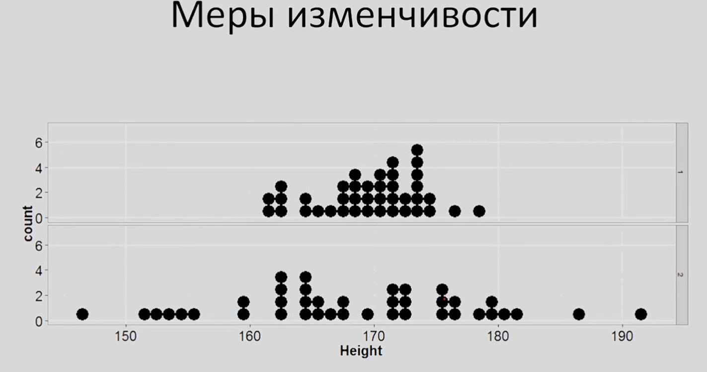
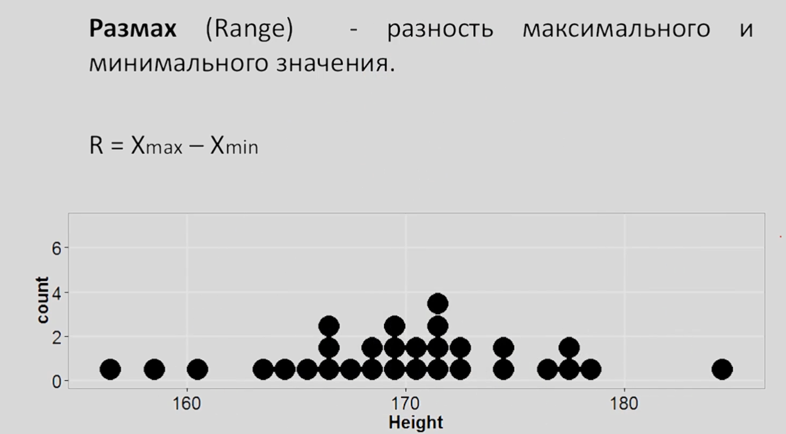
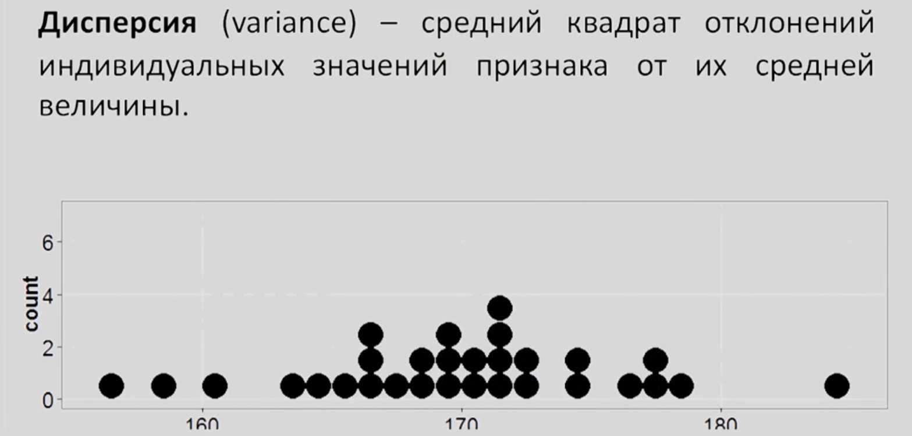
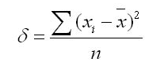
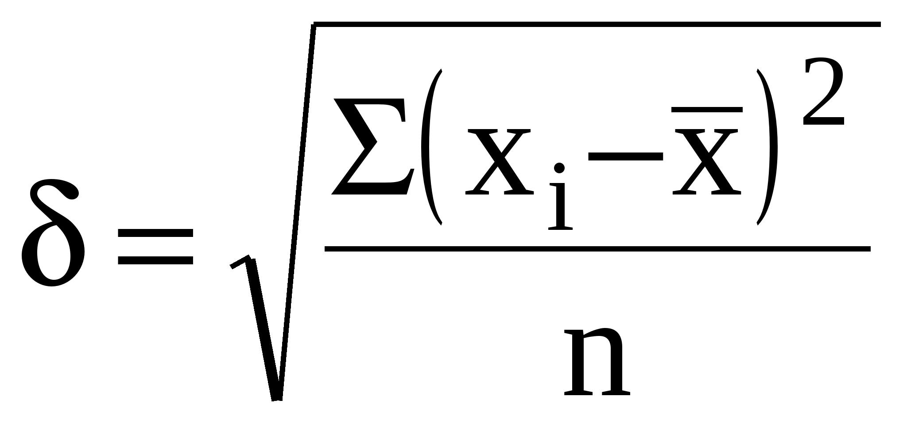
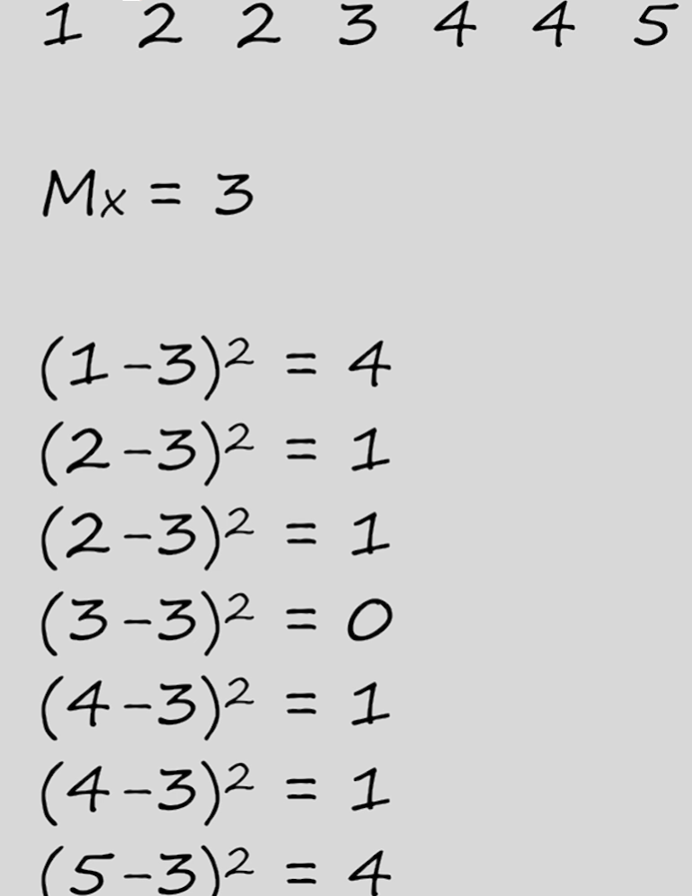
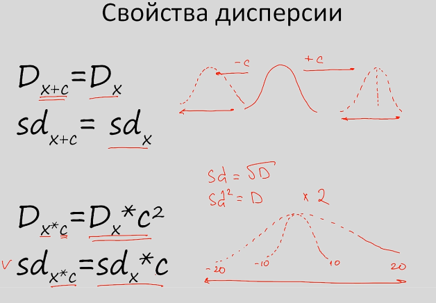

# Меры изменчивости

Мы познакомились с основными мерами центральной тенденции и теперь без труда сможем описать наши данные с точки зрения степени выраженности некоторого количественного признака. 

Однако, если мы посмотрим на рисунок

легко заметить, что эти два распределения отличаются скорее не по выраженности некоторого признака (среднее значение, мода и медиана будут приблизительно одинаковы в обоих случаях), а скорее по изменчивости данных.

Как же нам рассчитать показатели, которые  будут характеризовать именно изменчивость исследуемого признака?

## Размах

Одна из самых простых мер изменчивости - это **размах** (разность между максимальным и минимальным значением нашего распределения).

Давайте посмотрим на нашу выборку.

Xmax = 185

Xmin = 157

Размах = Xmax - Xmin = 185 - 157 = 28

Данная мера имеет недостатки. Она рассчитывает изменчивость, учитывая только крайние значения, и любое изменение одного из них будет очень болезненно отражаться на итоговом результате.

Достаточно вспомнить пример с добавлением одного очень сильно отличающегося от остальных значения признака.

Размах изменится очень сильно.

Как рассчитать изменчивость данных, используя каждое из значений.

## Дисперсия

Как нам использовать все без исключения значения признака для рассчёта мер изменчивости?

Один из возможных вариантов - *посмотреть насколько в среднем наше значение отклоняется от среднего значения по выборке***.

Давайте разберёмся что же это означает.

**Дисперсия (variance)** - средний квадрат отклонений индивидуальных значений признака от их средней величины.

Среднее значение нашей выборки = 170,4.

Поскольку все элементы выборки могут отклоняться от среднего значения на разные величины (большие и малые, положительные и отрицательные) усреднение и кадрат при расчёте диперсию дадут объективную картину.

В квадрат мы возводили для того чтобы избавить от отрицательных отклонений и в итоге результат дисперсии будет превышать реальное среднее отклонение наших наблюдений от среднего по выборке. Чтобы вернуть к реальным величинам измерения, давайте извлечем квадратный корень из дисперсии.

Среднеквадратичное отклонение - это корень из дисперсии:

И в отличие от дисперсии оно показывает реальное среднее значение наших отклонений от среднего значения по выборке.

В зависимости от того говорим мы о среднеквадратичном отклонении выборки или все генеральной совокупности в целом используются разные обозначения.

Среднеквадратичное отклонение генеральной совокупности = сигма.

**SD** - среднеквадратичное отклонение выборки.

**ВАЖНО: Формула дисперсии, указанная на рисунке выше применима для рассчёта на генеральной совокупности, для рассчёта дисперсии выборки нужно добавить минус 1 в знаменатель.**

Единица вычитается из-за степеней свободы (будет рассказано дальше).

## Пример

Пусть есть 7 наблюдений некоторого количественного признака.

Ищем среднее, для каждого наблюдения ищем его отклонение от среднего (3), сложить эти отклоенения, разделить на число элементов минус 1.

D = (4 + 1 + 1 + 0 + 1 + 1 + 4) / (7 - 1) = 12 / 6 = 2

SD = корень из D = 1,4 (примерно)

## Свойства дисперсии

