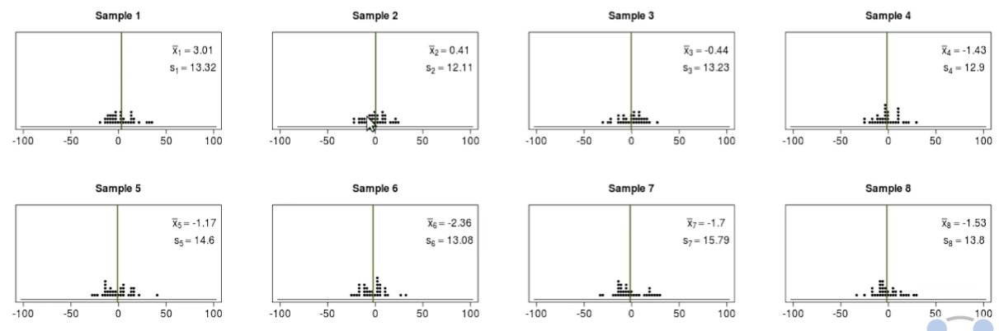
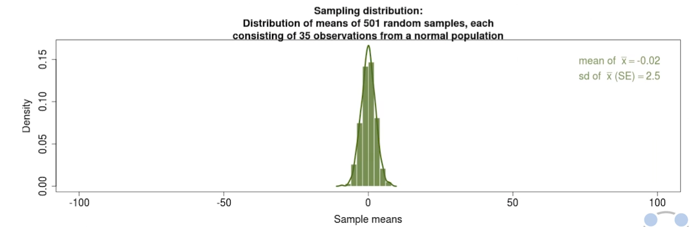
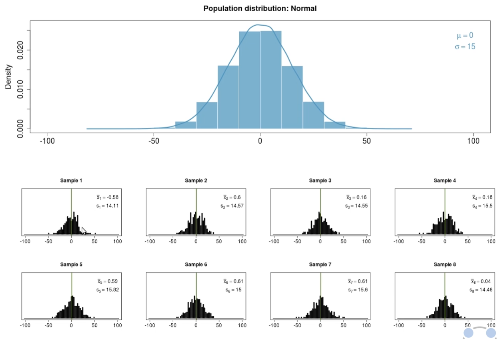
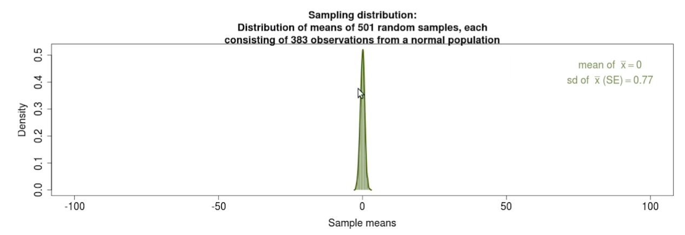
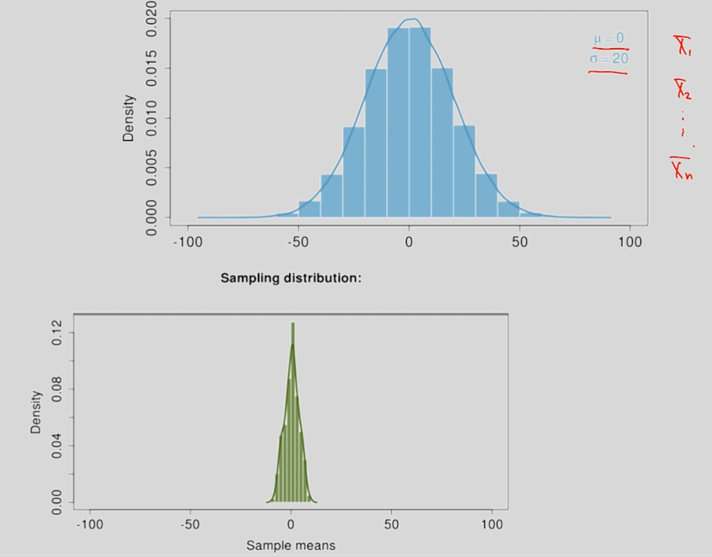
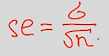
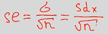
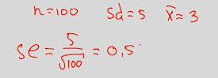

# Центральная предельная теорема

В ситуации нормального распределения мы легко вычислим, что отклонение от среднего превысит некую интересующую нас величину.

Держа в уме это свойство нормального распределения, познакомимся с центральной предельной теоремой, которая лежит в основании идеи статистической проверки гипотез.

Адрес использующегося в лекции сайта: [ссылка](https://gallery.shinyapps.io/CLT_mean/)

Допустим, некоторый признак распределён нормально в генеральной совокупности и имеет среднее значение равное нулю и стандартное отклонение равное 15. 

Давайте будем многократно извлекать выборки из нашей генеральной совокупности по 35 наблюдений в каждой. И внутри каждой из выборок рассчитывать среднее значение и стандартное отклонение. Мы видим, что распределение признака меняется от выборки к выборке.

При этом значения средних также варьируются – где-то это положительное отклонение от реального показателя, где-то отрицательное; где-то это более точные оценки, а где-то отклонения значительны.

Например, в самой первой выборке мы получили выборочное среднее значение равное 3, хотя в генеральной совокупности – 0. 

Что произойдёт, если мы рассчитаем среднее значение внутри каждой из выборок и построим распределение выборочных средних значений?

Мы получим следующую картину:

Если внутри каждой из выборок оценка реального показателя может быть не столь точной, то в среднем выборочные средние значения предоставят довольно неплохой показатель и среднее всех средних будет очень близко к реальному среднему в генеральной совокупности.

Мы видим, что большинство всех наших выборочных средних лежат рядом с 0 и какие-то отклоняются в положительную сторону, какие-то в отрицательную. 

Стандартное отклонение этого распределения называется стандартной ошибкой среднего и показывает насколько в среднем выборочное значение отклоняется от среднего генеральной совокупности.

Что произойдёт, если значительно увеличить объём каждой из выборок?

Во-первых, распределение признака внутри каждой из групп стало больше напоминать картину из генеральной совокупности. Выборочные оценки также стали более точными. 

Но, если посмотреть на распределение выборочных средних значений, то увидим, что стандартная ошибка значительно уменьшилась – теперь большинство наших наблюдений лежит близко с реальным показателем:

## Формулировка ЦПТ

Предположим, что исследуемый нами признак имеет нормальное распределение в генеральной совокупности с некоторым средним значением (0) и стандартным отклонением (20), и мы многократно извлекаем выборки объёма n, и в каждой выборке вычисляем среднее значение и потом строим распределение этих выборочных средних.

Такое распределение будет являться нормальным со средним, таким же, как и в генеральной совокупности, и со стандартным отклонением (стандартная ошибка среднего), которое вычисляется по формуле:

В формуле выше числитель – стандартное отклонение признаков генеральной совокупности, а в знаменателе – корень из числа наблюдений.

Математически доказывать эту формулу не будем, обсудим основную идею:

**Чем больше наблюдений в выборке, тем ближе все выборочные средние к реальному среднему значению генеральной совокупности. **

Поэтому изменчивость всех выборочных средних будет тем меньше, чем больше элементов в нашей генеральной совокупности. Чем меньше изменчивость исследуемого признака в генеральной совокупности, тем реже будут возникать сильные отклонения выборочных средних от среднего генеральной совокупности. Поэтому, чем больше число наблюдений, чем меньше изменчивость признака, тем меньше будет стандартная ошибка.

Если выполняется условие: **число наблюдений выборки больше 30, и выборка репрезентативна, то формула приводится к:**

Где SDx – стандартное отклонение нашей выборки.

Пусть мы извлекли только одну выборку из генеральной совокупности, например, 100 наблюдений с SD=5 и средним = 3.

То есть, имея на руках только одну выборку, мы можем предсказать, как бы вели себя все выборочные средние – они бы распределились вокруг среднего генеральной совокупности со стандартным отклонением равным 0,5.

