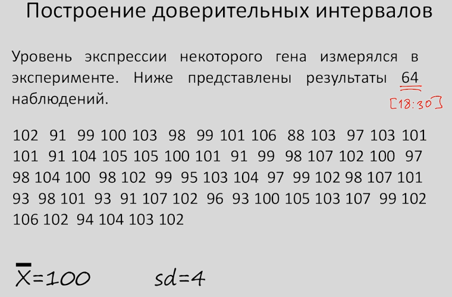
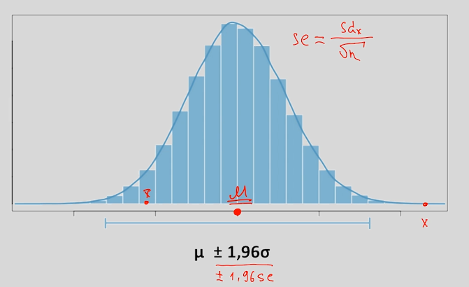
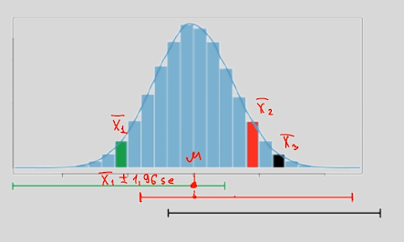

# Построение доверительных интервалов

Наша первая статистическая задача, связанная с применением ЦПТ будет связана с построением доверительного интервала для среднего значения.

Целью статистики является сделать выводы относительно генеральной совокупности, основываясь только на выборочных данных.

Очень часто исследователя интересует – чему равно среднее значение исследуемого признака во всей генеральной совокупности.

Давайте рассмотрим пример.

Исследователя интересует - чему равно среднее значение уровня экспрессии гена во всей генеральной совокупности. В нашем случае генеральная совокупность: все мужчины и женщины от 18 до 30 лет.Мы не сможет дать точный ответ, но можем дать интервал, в котором гарантированно находится нужное нам среднее значение.

Если бы многократно повторяли эксперимент, то все выборочные средние равномерно распределились бы относительно среднего генеральной совокупности со стандартным отклонением (стандартной ошибкой среднего) равным стандартное отклонение генеральной совокупности, делённое на корень из числа наблюдений.

95% всех выборочных средних лежали бы в диапазоне: среднее значение генеральной совокупности +\- 1,96 * стандартная ошибка среднего.

Но как нам это поможет, учитывая, что среднее значение выборки может быть где угодно относительно среднего значения генеральной совокупности, а его мы как раз и хотим вычислить.

Предположим, что мы рассчитываем такой показатель для каждого из выборочных средних. 

Допустим, зелёный столбик – это распределение выборочного среднего для выборки 1. Тогда если построить доверительный интервал для этой выборки, он включит в себя среднее значение генеральной совокупности. Если аналогично сделать для x2 и x3, то всё будет аналогично.

Таким образом, 95% всех выборочных средних включили бы в себя среднее значение генеральной совокупности, если бы мы рассчитывали такой интервал. И только 5% совсем отдалённых значений не включили бы в себя среднее значение генеральной совокупности.

## Расчёт доверительного интервала для наших выборочных данных.

Среднее значение по выборке = 100

Стандартное отклонение (sd) = 4

N = 64 наблюдения

Найдём стандартную ошибку среднего = 4 / корень из 64 = 0.5

Рассчитаем 95%-й доверительный интервал:

Нужно определить правую и левую границы, а центром будет наше выборочное среднее:

Правая граница: среднее + 1.96 * se = 100 + 1.96 * 0.5 = 100.98

Левая граница: среднее - 1.96 * se = 100 - 1.96 * 0.5 = 99.02

Рассчитав такой интервал мы может на 95% быть уверены в том, что он содержит среднее генеральной совокупности.
Можно рассчитывать более широкие доверительные интервалы: 99%-й, например, (выборочное среднее +\- 2.58 * se).
[Пост о доверительных интервалах](http://tcts.cogitoergo.ru/blog/golova-professora-bambldorfa/).

