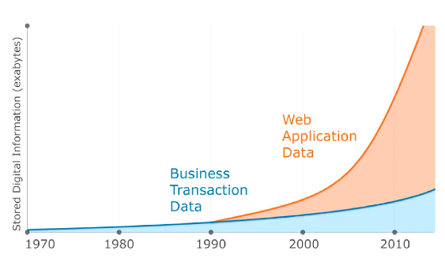
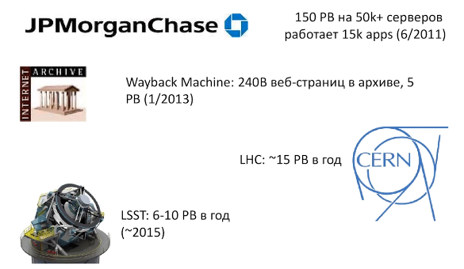

# Введение

`Big data` - популярная и стремительно развивающаяся область в ИТ.

Судя по графику, последние 10-15 лет наблюдается непрекращающийся взрывной рост количества данных за счёт WEB-приложений и социальных сетей.

+ Рост количества информации
+ Обработка и аналитика должна быть быстрой

Нужны технологии обработки больших объёмов данных, нужны соответствующие специалисты.

По информации на 2010г. информации были 1.2 зеттабайт (триллиона Гигабайт) по данным Information Data Corporation).

Нужен общий универсальный фреймворк, чтобы с помощью него можно было обрабатывать относительно легко большие объёмы данных.

## История Hadoop

## Полезные ресурсы

Большинство систем, о которых пойдет речь в курсе, являются проектами верхнего уровня Apache. Поэтому все, что касается этих проектов (в частности документацию по ним) можно найти на соответствующих сайтах:

+ [Hadoop и HDFS](http://hadoop.apache.org/)
+ [HBase](https://hbase.apache.org/)
+ [Cassandra](http://cassandra.apache.org/)
+ [Pig](https://pig.apache.org/)
+ [Hive](https://hive.apache.org/)
+ [Spark](http://spark.apache.org/)

Вендоры Hadoop предоставляют свою [документацию](https://ccp.cloudera.com/display/DOC/Documentation)
Скачать дистрибутив Cloudera Hadoop можно по [ссылке](http://www.cloudera.com/content/www/en-us/downloads.html)

По многим системам есть отдельные книги:
+ Hadoop: The Definitive Guide (Hadoop. Подробное руководство). Tom White. O'Reilly Media; 4rd Edition
+ MapReduce Design Patterns. Donald Miner, Adam Shook. O'Reilly Media
+ HBase: The Definitive Guide. Lars George. O'Reilly Media; 1 edition
+ Data-Intensive Text Processing with MapReduce. Jimmy Lin and Chris Dyer (April, 2010)
+ Programming Pig. Alan Gates. O'Reilly Media; 1st Edition
+ Programming Hive. Edward Capriolo, Dean Wampler, Jason Rutherglen. O'Reilly Media; 1 edition
